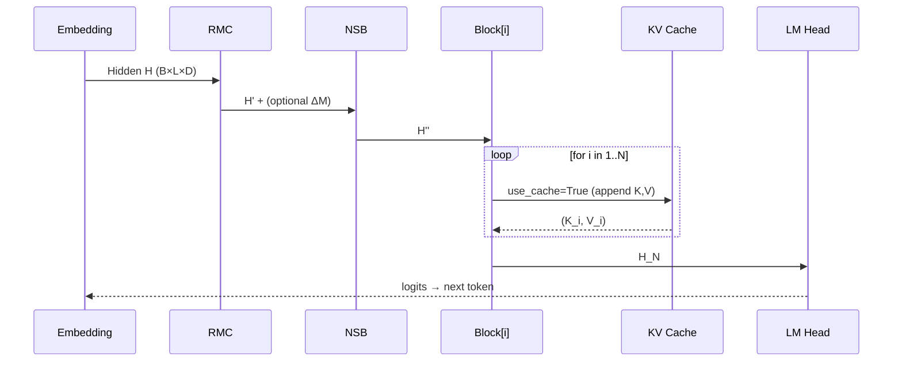

# NeoFormer‑X — Architecture & Developer Guide

> Version: 0.1 • Target: research/production hybrid • Author:Venkataramana kurumalla 

---

## 1) High‑Level Overview

NeoFormer‑X is a decoder‑only language model designed for efficient long‑context autoregressive generation. It combines:

* **GQA (Grouped‑Query Attention)** in a compact causal attention core
* **RoPE (Rotary Positional Embeddings)** for extrapolatable positions
* **RMC (Recursive Memory Core)** for persistent episode‑level memory
* **NSB (Neural‑Symbolic Bridge)** that softly selects/infuses latent “rules”
* **Pre‑Norm Transformer blocks** with lightweight FFNs (SiLU/GLU‑style)
* **KV caching** for fast incremental decoding
* **LoRA hooks** for parameter‑efficient finetuning

This document explains the system layout, dataflow, configs, training & inference.

---

## 2) Architecture Diagram (Mermaid)

> Paste this into [https://mermaid.live](https://mermaid.live) to render, or use a Markdown viewer with Mermaid support.

```mermaid
flowchart TD
  subgraph Input
    T[Token IDs]
  end

  T -->|Embedding| EMB[Token Embedding]

  subgraph Memory Layer
    direction LR
    RMC[RMC\n(Recursive Memory Core)]
    NSB[NSB\n(Neural‑Symbolic Bridge)]
  end

  EMB --> RMC --> NSB --> H0[Hidden State 0]

  subgraph Transformer Stack
    direction TB
    B1[Block 1\n(PreNorm + Causal GQA + FFN)]
    B2[Block 2]
    B3[...]
    BN[Block N]
  end

  H0 --> B1 --> B2 --> B3 --> BN --> HN[Hidden State N]

  HN --> LN[LayerNorm]
  LN --> LM[LM Head (weight tied)]
  LM -->|Softmax (train) / Sample (gen)| OUT[Next Token]

  %% KV Caches
  B1 -.KV cache.-> B1
  B2 -.KV cache.-> B2
  BN -.KV cache.-> BN
```

---

## 3) Component Reference

### 3.1 Token Embedding

* Standard learned embedding, dimension `d_model`.
* Weights tied with `LM Head` to reduce params & improve stability.

### 3.2 RMC — Recursive Memory Core

* Maintains a small learnable memory matrix `M ∈ R^{mem×d}`.
* **Read**: attention‑like projection from batch average → weighted memory vector; concatenated with token states and projected back to `d_model`.
* **Write** (optional during training): produces a delta to update `M` with a small LR (EMA‑like), enabling episode‑level persistence.

### 3.3 NSB — Neural‑Symbolic Bridge

* A small rule bank `R ∈ R^{rules×rdim}` (embedding).
* Projects hidden states to rule space, computes soft selection over `R`, fuses via FFN with residual.
* Intuition: inject coarse prior patterns (“rules”) without hard constraints.

### 3.4 Transformer Block (Pre‑Norm)

* **Norm1 → Causal GQA Attention → Residual**
* **Norm2 → FFN (SiLU/GLU‑style) → Residual**
* **GQA**: fewer KV heads than Q heads, repeated across groups for compute savings.
* **RoPE**: applied to Q/K in head space; no additive sinusoidal/absolute positions.

### 3.5 Causal Attention with KV Cache

* Tuple cache `(K,V)` per block, shape `[B, H, L, Dh]`.
* FlashAttention‑2 path if available; else PyTorch SDPA with causal mask.

### 3.6 LM Head

* Linear map to vocab size, tied to embedding matrix.

---

## 4) Data Flow

1. **Tokens → Embedding** → hidden `H`.
2. **RMC** reads memory with batch summary and (optionally) emits `ΔM` for later update.
3. **NSB** blends latent rules into `H`.
4. **N Transformer Blocks** apply Pre‑Norm Attention + FFN with RoPE and GQA; KV caches stored per block when `use_cache=True`.
5. Final **LayerNorm → LM Head** to get logits; train with cross‑entropy.
6. During generation, feed only the latest token once caches exist; periodically trim context & caches.

---

## 5) Configuration Cheatsheet

* **Model sizes** (example presets):

  * `125M`: `(d_model=768, nhead=12, kv_heads=3, layers=12)`
  * `350M`: `(1024, 16, 4, 24)`
  * `760M`: `(1536, 16, 4, 32)`
* **Memory**: `mem_size` (e.g., 32)
* **Rules**: `rules`, `rdim` (e.g., 32/32)
* **Seq Len**: training `seq`; inference `max_seq_len` with trimming strategy
* **Tokenizer**: `tiktoken cl100k_base` (fallback to HF GPT‑2)

---

## 6) Training Recipe (Minimal)

**Objective**: Cross‑entropy over next‑token prediction.

**Loop** (per batch):

1. Encode text, form `(X, Y)` with window `seq`.
2. Forward with `update=True` to get `(logits, _, ΔM)`.
3. Compute `loss = CE(logits.view(−1, V), Y.view(−1))`.
4. Backprop, optimizer step (AdamW recommended to start).
5. If `ΔM` is not `None`, apply `rmc.apply_update(ΔM.mean(0), lr=0.01)`.

**Recommended knobs**:

* `bfloat16` autocast + GradScaler on CUDA
* Cosine schedule w/ warmup (optional)
* Gradient clipping `1.0`
* Dataset: `openwebtext` streaming for quick experiments

**Ablations** (helpful early):

* Disable NSB to gauge contribution
* Compare `kv_heads ∈ {1, nhead/4, nhead}`
* RoPE base sweep (e.g., 10k vs NTK‑scaled variants)

---

## 7) Inference & Decoding

* **Cache‑aware generation**: after first full pass, feed only `x[:, -1:]` with `past` caches.
* **Context trimming**: when tokens exceed `max_seq_len`, keep a rolling window (e.g., half) and trim caches accordingly.
* **Sampling**:

  * Temperature `temp` (0.7‑1.0 good defaults)
  * Top‑k, optionally add **top‑p** & **repetition penalty** (see Enhancements below)

**Pseudo‑API** (already implemented in the fixed script):

```python
out = model.generate(input_ids, max_new=64, temp=0.8, top_k=50)
```

---

## 8) Implementation Notes & Pitfalls

* **Do not** add absolute positional encodings when using RoPE (it causes scale drift).
* Keep KV caches as a **tuple** `(K, V)`; avoid stacking an extra dimension.
* Ensure RoPE buffers (cos/sin) are created **on the right device** lazily.
* When trimming, slice caches as `k[:, :, -keep:, :]` and same for `v`.
* With LoRA, target modules `{q_proj, k_proj, v_proj}` are sufficient initially.

---

## 9) Enhancements (Optional)

* **RMSNorm**: swap LayerNorms for RMSNorm for speed/stability on small GPUs.
* **SwiGLU FFN**: replace MLP with gated variant: `Linear(d,4d*2) → chunk → SiLU(gate)*val → Linear(4d,d)`.
* **Top‑p & Repetition Penalty** in `generate()`:

  * Add nucleus filtering and token repetition penalty for better long‑form quality.
* **Gradient Checkpointing**:

  * Use call‑time `torch.utils.checkpoint.checkpoint` wrapping each block if memory is a constraint.
* **Paged/KV cache on CPU** for very long contexts.

---

## 10) Example CLI Workflows

**Quick train (smoke test):**

```bash
python neoformer_x_fixed.py --train --epochs 1 --batch 8 --seq 256 --max_tokens 50000
```

**Evaluate with lm‑eval (if installed):**

```bash
python neoformer_x_fixed.py --eval
```

**Sampling demo:**

```bash
python neoformer_x_fixed.py
```

---

## 11) API Summary

* `NeoFormerX.forward(x, past=None, update=False) → (logits, new_past, delta)`
* `NeoFormerX.generate(x, max_new=64, temp=0.8, top_k=50)`
* `RMC.apply_update(delta, lr=0.01)`

---

## 12) Limitations & Safety

* RMC updates are local and can drift; reset or anneal LR over long runs.
* NSB rule bank is randomly initialized; consider curriculum or pretraining to stabilize early training.
* Long‑context quality still depends on data; RoPE alone does not guarantee faithful recall.

---

## 13) Roadmap

* Add **top‑p** and **repetition penalty** into generation
* Swap LayerNorm → **RMSNorm**; FFN → **SwiGLU**
* Integrate **cosine schedule + warmup** and **Lion** optimizer option
* Optional DeepSpeed/FSDP for multi‑GPU scaling
* Export to **TorchScript** or **ONNX** for deployment

---

## 14) Mermaid: Internal Block Detail



---

### Appendix A — Minimal Training Loop (pseudo)

```python
for batch in loader:
    x,y = batch
    logits, _, delta = model(x, update=True)
    loss = F.cross_entropy(logits.view(-1, V), y.view(-1))
    loss.backward(); opt.step(); opt.zero_grad()
    if delta is not None:
        model.rmc.apply_update(delta.mean(0), lr=0.01)
```

---

**End of document.**
